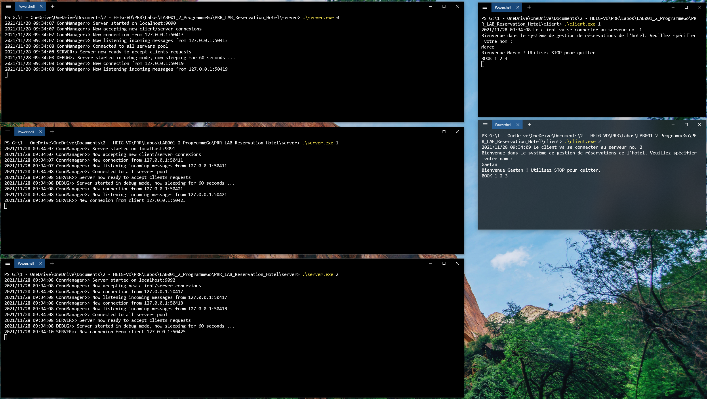
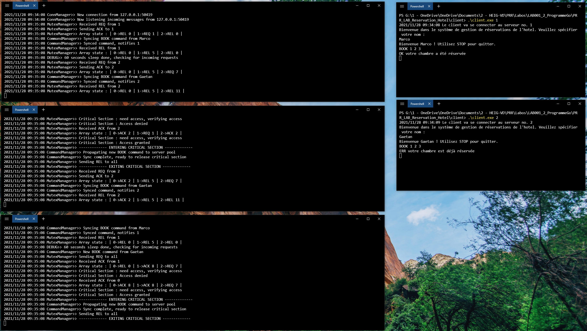

# PRR | Laboratoire 3 - Réservation de chambres d'hôtel

## Installation

### Structure du projet

Le projet est consitué de deux principaux dossiers : `client` et `server`

Chacun de ces dossiers contient un ficheir `main.go` qui représente le point d'entrée de chacun des deux programmes. Dans `client` il y a aussi un fichier `main_test.go` qui contient tous les tests permettant de vérifier que le service de réservation fonctionne correctement.

Le code est ensuite divisé dans divers packets qui séparent les différents aspects des programmes.

- Les paquets `clientTcp` et `serverTcp` contiennent les séquences de démarrage d'un client et d'un serveur (Création des channels et lancement de toutes les goroutines)
- Les paquets `utils` et `config` contiennent du code utilisé par les deux programmes 
- Le packet `logic` regroupe tout ce qui touche à la logique de réservation de chambres de l'hôtel
- Le paquet `cmd` contient tout ce qui touche aux commandes utilisateur (**Manager de commandes**)
- Le paquet `lamport` contient l'implémentation de l'algorithme de Lamport pour l'exclusion mutuelle du pool de serveurs réparti (**Manager du mutex**)
- Le paquet `lamport` contient toute la logique d'interconnexion des serveurs comprennant la réception et l'envoi de messages sur les sockets réseau (**Manager du réseau**)

Plus d'information disponible en générant une documentation grâce à l'utilitaire `godoc`

#### Structure par rapport au cours


- Le bloc `Processus Client` correspond au paquet `serverTcp`

- Le bloc `Processus Mutex` correspond au paquet `lamport`

- Le bloc `Processus Réseau` correspond au paquet `network`

### Cloner le repository

Pour commencer, ouvrir un terminal et exécuter la commande suivante :

```bash
git clone git@github.com:Ga-3tan/PRR_LAB_Reservation_Hotel.git
```

ou

```bash
git clone https://github.com/Ga-3tan/PRR_LAB_Reservation_Hotel.git
```

Un dossier va se créer avec tout le contenu du laboratoire. Il faut ensuite build le client et le serveur pour pouvoir les utiliser.

### Build le projet

**Build le serveur**

Pour build le serveur, il faut se rendre dans le dossier `PRR_L1_Reservation_Hotel/server` et ouvrir un terminal de commande dans ce dossier.

Utiliser ensuite la commande suivante pour créer un fichier exécutable du programme (golang doit être installé sur la machine au préalable)

```bash
go build
```

Un fichier `server` sera crée et pourra être lancé dans un terminal.

**Build le client**

Pour build le serveur, il faut se rendre dans le dossier `PRR_L1_Reservation_Hotel/client` et ouvrir un terminal de commande dans ce dossier.

Utiliser ensuite la commande suivante pour créer un fichier exécutable du programme (golang doit être installé sur la machine au préalable)

```bash
go build
```

Un fichier `client` sera crée et pourra être lancé dans un terminal.

### Utiliser le client et le serveur

Maintenant que les deux programes ont été build, il est possible de les lancer dans plusieurs terminaux de commande.

Initialement, le fichier de configuration `config/config.go` demande le lancement de **trois serveurs** de numéros 0, 1 et 2. Les clients peuvent être lancés sans limite. Ce fichier de configuration peut être modifié à volonté, tant qu'il reste valide.

> Au lancement, un serveur prend un numéro en argument de programme

> Au lancement, un client peut prendre un numéro de serveur sur lequel se connecter (si aucun numéro, alors aléatoire)

### Lancer les tests

Pour lancer les tests il suffit d'ouvrir un terminal dans le dossier `PRR_L1_Reservation_Hotel/client` et lancer la commande suivante.

```bash
go test
```

/!\ Pour que les tests fonctionnent il faut que :

- Il y ait au minimum 10 chambres
- Il y ait au minimum 20 jours
- L'instace du serveur lancée en arrière plan soit vierge (pas de chambres déjà réservées au lancement des tests)

Ces valeurs sont modifiables dans le fichier `config.go` qui se trouve dans le dossier `PRR_L1_Reservation_Hotel/config`

## Fonctionnalités

**Fonctionne**

- Réserver une chambre libre pour un jour donné et un nombre de nuits
- Lister le status (Libre, occupé, réservé) des chambres selon un jour donné
- Trouver une chambre libre selon un jour et un nombre de nuits donnés
- Lancer le serveur en mode debug (attente de X secondes avant la prise de requêtes client)
- Terminer la connexion au serveur avec la commande `STOP`
- Le fichier `config.go` dans le dossier `PRR_L1_Reservation_Hotel/config` contient les paramètres modifiables du programme
- Une documentation peut être générée grâce à l'utilitaire `godoc`
- L'utilitaire `go race` ne relève aucun problème d'accès concurrent pendant l'utilisation du serveur et de plusieurs clients
- Gestion des 

**Corrigé du premier laboratoire**

- Les réservations se chevauchant ne sont plus acceptées

**Nouveautés du second laboratoire**

- Interconnexion du pool de serveurs
- Connexion d'un client sur n'importe quel serveur
- Gestion de la concurrence du système distribué avec l'algorithme de Lamport

## Protocole

**Spécificités**

> -> Une chambre réservée le jour 1 pour 5 nuits sera libre le jour 6
> 
> -> Les numéros de chambre et de jours commencent à 1

### Messages réseau

#### Connexion

Lorsqu'un serveur ou un client se connecte à un serveur, le premier message est envoyé par celui qui se connecte afin d'indiquer son type.

**Un serveur qui se connecte envoie :**

```css
SRV
```

**Un client qui se connecte envoie :**

```css
CLI
```

#### Messages venant d'un serveur

##### Synchronisation

**Commande de synchronisation**

```css
SYNC [AuthorId]|[FromId]|[USERNAME]|[COMMAND]
```

> [AuthorId] -> Id de l'émetteur source de la commande
> 
> [FromId] -> Id de l'émetteur relais de la commande
> 
> [USERNAME] -> Nom du client ayant fait la commande
> 
> [COMMAND] -> La commande à synchroniser dans le système de l'hotel (ex. BOOK 1 2 3)

**Réponse de synchronisation**

Après synchronisation d'une commande externe, un serveur répond à l'émetteur de la commande de synchronisation afin qu'il puisse libérer la section critique.

```css
SYOK [FromId] [DestId]
```

Le serveur ayant lancé la commande de synchronisation va donc reçevoir une confirmation de tous les autres serveurs et pourra ensuite libérer la section critique en continuant l'exécution de l'algorithme de Lamport.

##### Lamport

**Message de Lamport**

```css
LPRT [MESSAGE]
```

> [MESSAGE] -> La commande avec son estampille et l'id de l'émetteur(ex. REQ 3 0)

##### Raymond

**Requête de Raymond**

```css
RAYM REQ [fromID]
```

**Échange de token**

```css
RAYM TOK [fromID]
```

**Tous les enfants du noeud sont connectés**

Envoyé au parent

```css
RDY
```

**La racine a reçu un RDY de tous ses enfants**

Envoyé par la racine à ses enfants 
Chaque nœud va le renvoyer à ses enfants pour se dire qu'il est prêt

```css
SRT
```

## Commandes client

**Réserver une chambre**

```css
BOOK [n° de chambre] [jour] [nb de nuits] 
```

**Lister les disponibilités des chambres**

```css
ROOMS [jour]
```

**Une chambre disponible pour un séjour précisé**

```css
FREE [jour] [nb de nuits]
```

**Quitter le service**

```css
STOP
```

### Types de réponses

##### Réponse à une réservation

```css
BOOK 5 2 3
OK votre chambre a été réservée
```

```css
BOOK 1 2 3
ERR votre chambre est déjà réservée
```

##### Liste des disponibilités des chambres

```css
ROOMS 7
| Chambre: 1, Status: OCCUPE
| Chambre: 2, Status: LIBRE
| Chambre: 3, Status: LIBRE
| Chambre: 4, Status: LIBRE
| Chambre: 5, Status: LIBRE
| Chambre: 6, Status: LIBRE
| Chambre: 7, Status: LIBRE
| Chambre: 8, Status: LIBRE
| Chambre: 9, Status: LIBRE
| Chambre: 10, Status: LIBRE
END
```

##### Réponse à une demande de chambre pour un séjour

```css
FREE 5 2
OK chambre 1 disponible
```

## Guide pour provoquer un accès concurrent (version Lamport)

### Description

Ce guide détaille les étapes pour provoquer un accès concurrent lors d'un envoi de la même commande depuis plusieurs clients vers plusieurs serveurs différents du pool. Cela permet de vérifier le bon fonctionnement de la gestion de la concurrence.

Lorsqu'il est en mode `debug`, le serveur démarre et accepte les nouvelles connexions client. Le contexte s'occupant du traitement des requêtes se met en pause pendant X secondes afin de laisser le temps à la création d'un accès concurrent.

Pour ce test, le pool contient **trois serveurs (0, 1 et 2)** interconnectés et **deux clients** effectuant la même requete `BOOK 1 2 3` en même temps vers les serveurs 1 et 2.

### Etapes

**1 - Activer le mode `debug`**

-> Ouvrir le fichier `config.go`se trouvant dans le dossier `hôtel/config`

-> Modifier le champ `DEBUG` en lui affectant la valeur 1 :

```go
DEBUG = 1
```

-> Modifier si nécessaire le temps de "sommeil" du serveur au démarrage. Ce temps de sommeil sera le temps pour lancer les deux clients et écrire les deux requêtes. (temps conseillé 45s-60s)

```go
DEBUG_SLEEP = X // Remplacer X par le nombre de secondes à attendre
```


**2 - Préparer plusieurs terminaux de commande**

-> Ouvrir 5 terminaux de commande et les placer côte à côte

-> Démarrer deux instances de clients se connectant aux serveurs 1 et 2

```bash
client 1
client 2
```

-> Démarrer trois instances de serveurs

> ATTENTION /!\ Au démarrage du dernier serveur, le pool va se connecter et vous aurez X secondes pour provoquer l'accès concurrent !

```bash
server 0
server 1
server 2
```


**3 - Provoquer l'accès concurrent**

-> Dès que le serveur est lancé, entrer deux noms de différents sur chaque client

-> Envoyer la requête suivante depuis les deux clients

```sh
BOOK 1 2 3
```

> Cette commande demande la réservation de la chambre 1 depuis le jour 2 pendant 3 nuits



**4 - Résultat de la manipulation**

-> A ce moment, les deux clients vont se bloquer jusqu'à ce que les serveur terminent ensemble les X secondes d'attente. Ils vont ensuite traîter les deux commandes et envoyer les retours aux clients.

-> L'un des clients aura donc obtenu la réservation et l'autre reçevra un message de refus, l'accès concurent aura été provoqué et  correctement géré par l'algorithme de Lamport afin que l'état de l'hotel soit le même sur tous les serveurs.



Le log des serveurs permet de suivre l'exécution de l'algorithme de Lamport. Les accès à la section critique et les synchronisation de commandes sont mises en évidence.

## Guide pour provoquer un accès concurrent (version Raymond)

> note importante : pour une raison obscure il se peut que le système se bloque lors de l'initialisation des serveurs. Cela occure lorsque les serveur 1 et 2 envoie leur RDY en même temps à 0. Cela est dû à un des RDY qui se perd (oui oui on arrive à perdre des messages en TCP, #magieNoire). Nous avons trouvé une sorte de "fix" en introduisant un sleep (différent entre chaque serveur) juste avant l'envoi d'un RDY.

### Description

Ce guide détaille les étapes pour provoquer un accès concurrent lors d'un envoi de la même commande depuis plusieurs clients vers plusieurs serveurs différents du pool. Cela permet de vérifier le bon fonctionnement de la gestion de la concurrence.

Lorsqu'il est en mode `debug`, le serveur démarre et accepte les nouvelles connexions client. Le contexte s'occupant du traitement des requêtes se met en pause pendant X secondes afin de laisser le temps à la création d'un accès concurrent.

Pour ce test, le pool contient **quatre serveurs (0, 1, 2 et 3)** interconnectés selon la topologie suivante :


 Ainsi que **deux clients** effectuant la même requete `BOOK 1 2 3` en même temps vers les serveurs 2 et 3.

### Etapes

**1 - Activer le mode `debug`**

-> Ouvrir le fichier `config.go`se trouvant dans le dossier `hôtel/config`

-> Modifier le champ `DEBUG` en lui affectant la valeur 1 :

```go
DEBUG = 1
```

-> Modifier si nécessaire le temps de "sommeil" du serveur au démarrage. Ce temps de sommeil sera le temps pour lancer les deux clients et écrire les deux requêtes. (temps conseillé 45s-60s)

```go
DEBUG_SLEEP = X // Remplacer X par le nombre de secondes à attendre
```


**2 - Préparer plusieurs terminaux de commande**

-> Ouvrir 6 terminaux de commande et les placer côte à côte

-> Démarrer deux instances de clients se connectant aux serveurs 1 et 2

```bash
client 1
client 2
```

-> Démarrer quatre instances de serveurs

> ATTENTION /!\ Au démarrage du dernier serveur, le pool va se connecter et vous aurez X secondes pour provoquer l'accès concurrent !

```bash
server 0
server 1
server 2
server 3
```

[insert photo]

**3 - Provoquer l'accès concurrent**

-> Dès que le serveur est lancé, entrer deux noms de différents sur chaque client

-> Envoyer la requête suivante depuis les deux clients

```sh
BOOK 1 2 3
```

> Cette commande demande la réservation de la chambre 1 depuis le jour 2 pendant 3 nuits

[insert photo]

**4 - Résultat de la manipulation**

-> A ce moment, les deux clients vont se bloquer jusqu'à ce que les serveur terminent ensemble les X secondes d'attente. Ils vont ensuite traiter les deux commandes et envoyer les retours aux clients.

-> L'un des clients aura donc obtenu la réservation et l'autre recevra un message de refus, l'accès concurrent aura été provoqué et correctement géré par l'algorithme de Raymond afin que l'état de l'hôtel soit le même sur tous les serveurs.

[insert photo]

Le log des serveurs permet de suivre l'exécution de l'algorithme de Raymond ainsi que la connexion entre les différents noeud. Les accès à la section critique et les synchronisation de commandes sont mises en évidence.

## License

[MIT](https://choosealicense.com/licenses/mit/)
